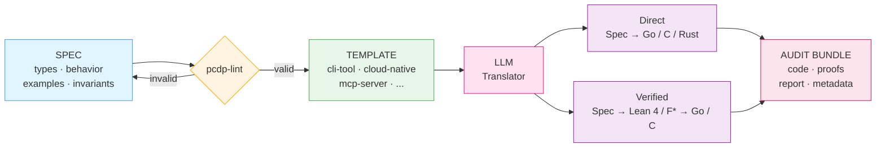
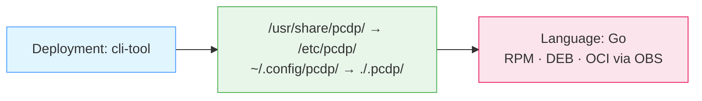

# PCDP — Post-Coding Development Paradigm

**Human Intent, Machine Implementation.**

PCDP is an open specification for a new software development paradigm: domain experts write structured natural-language specifications; AI generates all implementation code. Engineers never write implementation code directly.

This is not "AI-assisted coding" where developers write code with AI suggestions. This is **post-coding development** where specifications are the primary artifact and code is a generated output.

`pcdp-lint`, the reference validator in this repository, was itself specified and generated using PCDP — with zero hand-written implementation code.

---

## Core Workflow



---

## Target Language Resolution

The target language is **never declared in the specification**. It is derived automatically from the deployment template.



---

## Key Concepts

**Deployment templates** define what a target environment requires — language defaults, binary type, packaging formats, installation method, conventions. The spec author declares `Deployment: cli-tool` and the template resolves all implementation details automatically.

**Verification paths** are optional and pluggable:
- *Direct path:* Specification → Go/C/Rust — fast iteration, lower assurance
- *Verified path:* Specification → Lean 4/F*/Dafny → Go/C — formal proofs, highest assurance

**Audit bundles** are first-class outputs: specification + generated code + proofs (if any) + translation report + metadata. Designed for regulatory compliance with ISO 26262, DO-178C, IEC 62304, and Common Criteria.

---

## Quick Start

### Step 1 — Write a specification

**Option A — AI-assisted interview *(recommended)***

Domain experts do not need to learn the specification format. Use
`prompts/interview-prompt.md` with any capable LLM — including small models
running locally without GPU acceleration.

- **No existing material:** the model interviews the expert one question at a time
- **Existing material** (email, meeting notes, design doc): paste it in — the model extracts what it can and asks only for what is missing

```bash
# with a local model:
ollama run llama3.2 "$(cat prompts/interview-prompt.md)"
```

**Option B — Write the spec directly**

Every specification follows this structure:

```markdown
# My Component

## META
Deployment:   cli-tool
Version:      0.1.0
Spec-Schema:  0.3.15
Author:       Your Name <you@example.org>
License:      Apache-2.0
Verification: none
Safety-Level: QM

## TYPES
...

## BEHAVIOR: my-operation
Constraint: required
INPUTS: ...
PRECONDITIONS: ...
STEPS:
  1. [action]; on failure → [error].
  2. [next action].
POSTCONDITIONS: ...
ERRORS: ...

## INVARIANTS
- [observable]      ...
- [implementation]  ...

## EXAMPLES

EXAMPLE: success_case
GIVEN: ...
WHEN:  ...
THEN:  ...

EXAMPLE: error_case
GIVEN: ...
WHEN:  ...
THEN:  result = Err(...)
```

Validate with `pcdp-lint myspec.md` before proceeding.

---

### Step 2 — Translate to code

Use the standard translator prompt from `prompts/prompt.md` with any capable LLM. The prompt instructs the LLM to:

- Derive the target language from the deployment template — never declared in the spec
- Produce all required deliverables from the template's DELIVERABLES section
- Write a `TRANSLATION_REPORT.md` documenting every decision and confidence level

---

## Self-Hosting

`pcdp-lint` — the validator in `tools/pcdp-lint/` — was developed using PCDP itself. The specification in `tools/pcdp-lint/spec/pcdp-lint.md` describes what the tool must do. The implementation in `tools/pcdp-lint/code/` was generated from that specification by an LLM, using `cli-tool.template.md` as the deployment template.

The LLM resolved Go as the target language from the template without being told. It produced the source code, RPM spec, Debian packaging, and a `TRANSLATION_REPORT.md` — all from the specification alone.

The same approach was tested across multiple LLMs of different capability classes, including a 120B open-weight model running at a regional European provider with no dependency on US cloud infrastructure. Every model resolved the target language correctly from the deployment template.

This is not a toy example. The paradigm specifies and generates its own tooling from the first real artifact.

---

## Repository Layout

```
pcdp/
├── README.md
├── LICENSE                            ← CC-BY-4.0 (specs, templates, whitepaper)
├── LICENSE-tools                      ← GPL-2.0-only (tools/)
├── CONTRIBUTING.md
│
├── doc/
│   ├── whitepaper.md                  ← canonical whitepaper
│   └── executive-brief.md             ← business / non-technical summary
│
├── hints/
│   ├── cloud-native.go.go-libvirt.hints.md
│   └── cloud-native.go.golang-crypto-ssh.hints.md
│
├── templates/
│   ├── cli-tool.template.md
│   ├── cloud-native.template.md
│   ├── mcp-server.template.md
│   ├── verified-library.template.md
│   ├── library-c-abi.template.md
│   ├── project-manifest.template.md
│   └── python-tool.template.md
│
├── tools/
│   └── pcdp-lint/                     ← GPL-2.0-only
│       ├── spec/pcdp-lint.md          ← specification
│       └── code/                      ← generated implementation
│
├── examples/
│   └── account-transfer.md
│
└── prompts/
    ├── prompt.md                      ← standard translator prompt
    ├── interview-prompt.md            ← AI-assisted spec authoring
    └── README-small-models.md
```

---

## Licensing

| Artifact | License |
|---|---|
| Whitepaper, specifications, templates | [CC-BY-4.0](LICENSE) |
| `pcdp-lint` and tools | [GPL-2.0-only](LICENSE-tools) |

The CC-BY-4.0 license on specifications and templates means anyone may implement the paradigm — including proprietary translators and commercial tools — provided attribution is given. The GPL-2.0-only license on `pcdp-lint` ensures the reference validator remains community-controlled and open.

---

## Status

Current version: **0.3.15** (draft)

This project is in active development. The specification format, deployment templates, and tooling are stabilising toward a v1.0 release. Feedback, issue reports, and contributions are welcome.

---

## Author

Matthias G. Eckermann — [pcdp@mailbox.org](mailto:pcdp@mailbox.org)
