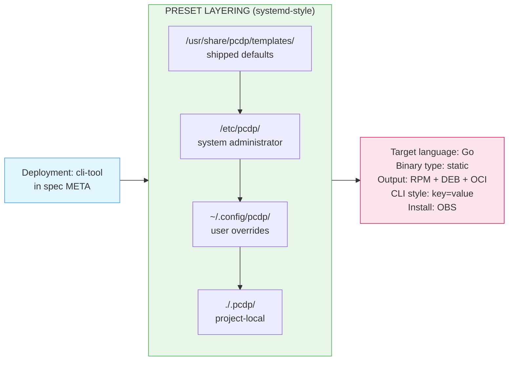

# PCDP — Post-Coding Development Paradigm

**Human Intent, Machine Implementation.**

PCDP is an open specification for a new software development paradigm: domain experts write structured natural-language specifications; AI generates all implementation code. Engineers never write implementation code directly.

This is not "AI-assisted coding" where developers write code with AI suggestions. This is **post-coding development** where specifications are the primary artifact and code is a generated output.

`pcdp-lint`, the reference validator in this repository, was itself specified and generated using PCDP — with zero hand-written implementation code.

---

## Core Workflow

```mermaid
flowchart TB
    subgraph human["<div style='text-align:left'>"HUMAN INPUT"]</div>
        spec["<div style='text-align:left'>Constrained Markdown Specification
        • Required sections 
        • Formal notation for pre/postconditions
        • Executable examples</div>"]
    end

    subgraph validation[" VALIDATION"]
        lint["pcdp-lint
        Structure & schema check
        SPDX license validation
        Deployment template resolution"]
    end

    subgraph template[" DEPLOYMENT TEMPLATE"]
        tmpl["pre-defined templates
        Resolves: target language, binary type,
        packaging formats, ..."]
    end

    subgraph ai[" AI TRANSLATION"]
        llm["LLM Translator
        Reads spec + template
        Produces all required deliverables"]
    end

    subgraph paths[" DUAL PATHS"]
        direct["Direct Path
        Spec → Go / C / Rust
        Fast iteration"]
        verified["Verified Path
        Spec → Lean 4 / F* / Dafny → Go / C
        Formal proofs, highest assurance"]
    end

    subgraph output[" AUDIT BUNDLE"]
        bundle["• Specification (human-reviewable)
        • Generated source code
        • Packaging artifacts (RPM, DEB, OCI)
        • Proofs (verified path only)
        • TRANSLATION_REPORT.md
        • metadata.json (traceability)"]
    end

    spec --> lint
    lint -->|Valid| tmpl
    lint -->|Invalid| spec
    tmpl --> llm
    llm --> direct
    llm --> verified
    direct --> bundle
    verified --> bundle

    style human fill:#e1f5ff,stroke:#4a9eff
    style validation fill:#fff4e1,stroke:#ffaa00
    style template fill:#e8f5e9,stroke:#4caf50
    style ai fill:#ffe1f0,stroke:#e91e8c
    style paths fill:#f3e5f5,stroke:#9c27b0
    style output fill:#fce4ec,stroke:#e91e63
```

---

## Target Language Resolution

The target language is **never declared in the specification**. It is derived automatically from the deployment template — keeping specifications technology-agnostic and stable over time.



---

## Repository Layout

```
pcdp/
├── README.md                          ← this file
├── LICENSE                            ← CC-BY-4.0 (specs, templates, whitepaper)
├── LICENSE-tools                      ← GPL-2.0-only (tools/)
├── CONTRIBUTING.md
│
├── whitepaper/
│   ├── document-template.tex          ← for translating markdown to pdf via pandoc
│   ├── executive-brief.md             ← business / non-technical summary
│   └── whitepaper.md                  ← canonical whitepaper
│
├── templates/
│   ├── cli-tool.template.md           ← CLI tool deployment template
│   ├── library-c-abi.template.md      ← general-purpose C-ABI libraries
│   ├── verified-library.template.md   ← safety/security-critical C-ABI libraries
│   ├── mcp-server.template.md         ← creating MCP servers directly
│   ├── project-manifest.template.md   ← template for larger projects
│   └── python-tool.template.md        ← Python tooling (QM only)
│
├── tools/
│   └── pcdp-lint/                     ← GPL-2.0-only
│       ├── spec/
│       │   └── pcdp-lint.md           ← specification for pcdp-lint
│       └── code/                      ← generated implementation
│
├── examples/
│   └── account-transfer/
│       └── account-transfer.md        ← worked example from whitepaper
│
└── prompts/
    ├── README-small-models.md         ← Optimization for smaller LLMs
    └── prompt.md                      ← standard translator prompt (A.13)
```

---

## Quick Start

### 1. Write a specification

Every specification follows this structure:

```markdown
# My Component

## META
Deployment:  cli-tool
Version:     0.1.0
Spec-Schema: 0.3.7
Author:      Your Name <you@example.org>
License:     Apache-2.0
Verification: none
Safety-Level: QM

## TYPES
...

## BEHAVIOR: my-function
INPUTS: ...
PRECONDITIONS: ...
POSTCONDITIONS: ...

## PRECONDITIONS
...

## POSTCONDITIONS
...

## INVARIANTS
...

## EXAMPLES

EXAMPLE: basic_case
GIVEN:
  ...
WHEN:
  ...
THEN:
  ...
```

### 2. Validate a specification (assuming the tool is already available as a package)

```bash
# Install pcdp-lint (openSUSE / SLES)
zypper install pcdp-lint

# Install pcdp-lint (Debian / Ubuntu)
apt install pcdp-lint

# Install pcdp-lint (Fedora)
dnf install pcdp-lint

# Validate a specification file
pcdp-lint myspec.md

# Strict mode (warnings treated as errors)
pcdp-lint strict=true myspec.md

# List available deployment templates
pcdp-lint list-templates
```

### 3. Translate a specification to code

Use the standard translator prompt from `prompts/prompt.md` with any capable LLM. The prompt instructs the LLM to:

- Derive the target language from the deployment template (never declared in the spec)
- Produce all required deliverables defined in the template's DELIVERABLES section
- Write a `TRANSLATION_REPORT.md` documenting decisions and confidence levels

---

## Self-Hosting

`pcdp-lint` — the validator in `tools/pcdp-lint/` — was developed using
PCDP itself. The specification in `tools/pcdp-lint/spec/pcdp-lint.md`
describes what the tool must do. The implementation in
`tools/pcdp-lint/code/` was generated from that specification by an LLM,
using `cli-tool.template.md` as the deployment template.

The LLM resolved Go as the target language from the template without being
told. It produced the source code, RPM spec, Debian packaging, and a
`TRANSLATION_REPORT.md` documenting every decision — all from the
specification alone.

The same approach was tested across multiple LLMs of different capability
classes, including a 120B open-weight model running at a regional European
provider with no dependency on US cloud infrastructure. Every model resolved
the target language correctly from the deployment template.

This is not a toy example. The paradigm specifies and generates its own
tooling from the first real artifact.

---

## Key Concepts

**Deployment templates** define what a target environment requires — language defaults, binary type, packaging formats, installation method, CLI conventions. The spec author declares `Deployment: cli-tool` and the template resolves all implementation details automatically.

**Verification paths** are optional and pluggable:
- *Direct path:* Specification → Go/C/Rust — fast iteration, lower assurance
- *Verified path:* Specification → Lean 4/F*/Dafny → Go/C — formal proofs, highest assurance

**Audit bundles** are first-class outputs: specification + generated code + proofs (if any) + translation report + metadata. Designed for regulatory compliance with ISO 26262, DO-178C, IEC 62304, and Common Criteria.

---

## Licensing

| Artifact | License |
|---|---|
| Whitepaper, specifications, templates | [CC-BY-4.0](LICENSE) |
| `pcdp-lint` and tools | [GPL-2.0-only](LICENSE-tools) |

The CC-BY-4.0 license on specifications and templates means anyone may implement the paradigm — including proprietary translators and commercial tools — provided attribution is given. The GPL-2.0-only license on `pcdp-lint` ensures the reference validator remains community-controlled and open.

---

## Status

Current version: **0.3.9** (draft)

This project is in active development. The specification format, deployment templates, and tooling are stabilising toward a v1.0 release. Feedback, issue reports, and contributions are welcome.

---

## Author

Matthias G. Eckermann — [pcdp@mailbox.org](mailto:pcdp@mailbox.org)
